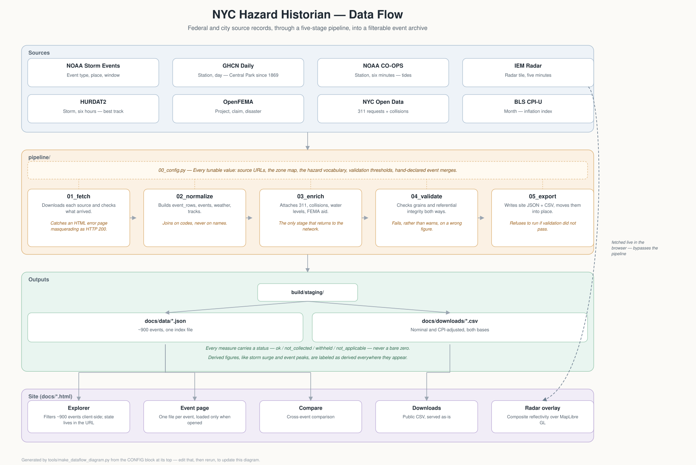

# NYC Hazard Historian

A public record of hazard events in New York City and their documented
consequences. Every figure carries its source, its period and its status, and
where there is no figure the site says why there is none.

The site is at [hazardhistorian.publicworks.nyc](https://hazardhistorian.publicworks.nyc).
It is an experimental project, not an official one. It has no standing, it can
be wrong, and no agency has checked it.

This README and the site's [method page](https://hazardhistorian.publicworks.nyc/method.html)
cover the same ground and are kept in step: the method page is written for a
reader, this file is written for whoever has to run the thing.

## Background

New York City Emergency Management publishes a Hazard History and Consequence
Tool. The underlying record is unusually rich. Getting a question answered out
of it is hard: thirteen consequence datasets each live on their own page, a
search cannot be linked or shared because it is a form post, and a measure that
nobody collected is printed as a zero. That last one matters most. The tool
reports 0 per cent of students absent during Hurricane Sandy, when schools were
closed for a week.

This is an independent rebuild from the original public sources. It is not
affiliated with New York City Emergency Management or the City of New York, and
it does not depend on their tool being available.

`research/hhc-audit.md` records what the existing tool does and where it fails.
`research/feature-source-matrix.md` records what was rebuilt, redesigned,
deferred or omitted, and why.

## Data sources

| Source | Grain | Coverage |
| --- | --- | --- |
| [NOAA Storm Events](https://www.ncei.noaa.gov/pub/data/swdi/stormevents/csvfiles/) | Event type, place, window | 1950 to present, all types from 1996 |
| [GHCN Daily](https://www.ncei.noaa.gov/data/global-historical-climatology-network-daily/) | Station, day | Central Park from 1869 |
| [NOAA CO-OPS](https://api.tidesandcurrents.noaa.gov/) | Station, six minutes | The Battery from 1920 |
| [Iowa Environmental Mesonet](https://mesonet.agron.iastate.edu/) | Radar tile, five minutes | N0R from the 1990s, N0Q from 2011 |
| [HURDAT2](https://www.nhc.noaa.gov/data/) | Storm, six hours | 1851 to 2025 |
| [OpenFEMA](https://www.fema.gov/about/openfema/data-sets) | Project, claim, disaster | PA 1998, NFIP 1978 |
| [NYC Open Data](https://data.cityofnewyork.us/) | Service request, collision | 311 from 2004, collisions from July 2012 |
| [BLS CPI-U](https://www.bls.gov/cpi/) | Month | New York area, 1953 to present |

`research/source-manifest.md` records what was checked by direct request, what
was rejected and why.

## Analysis



*Generated by [`tools/make_dataflow_diagram.py`](tools/make_dataflow_diagram.py). Edit the `CONFIG` block at the top of that file and rerun it when a source, stage or rule changes. The same diagram is on the method page, and an interactive version is at [`docs/dataflow.html`](docs/dataflow.html).*

### The pipeline

Five stages, deliberately separate, so a change to one does not re-run the
others. Standard library only: no pandas, no install step, no virtual
environment. The data is small enough not to need them, and a project a
non-professional developer has to operate should not start with a dependency
list.

**`pipeline/00_config.py`** holds every tunable value: source URLs and dataset
versions, the zone and county mapping, the hazard vocabulary, validation
thresholds, unit conversions, the filterable characteristics, and the small list
of hand-declared event merges. Nothing downstream hard-codes a URL or a cutoff.

**`pipeline/01_fetch.py`** downloads each source and checks that what arrived is
what the next stage needs. A moved NOAA file and a FEMA outage both answer with
HTTP 200 and an HTML error page, which a naive fetch would write to disk and
hand on.

**`pipeline/02_normalize.py`** produces the canonical tables:

| Table | One row per |
| --- | --- |
| `event_rows` | NOAA event: one hazard type, one place, one window |
| `events` | Weather system, the site's unit of exploration |
| `weather` | Station, day, measure |
| `tracks` | Storm, six-hour best-track position |

**`pipeline/03_enrich.py`** is the only stage that goes back to the network after
the event list exists, and the slow one. It attaches 311 and collision counts,
water levels, and federal assistance.

**`pipeline/04_validate.py`** tests the grains rather than trusting them, checks
referential integrity in both directions, and refuses a build where a measure is
marked absent while carrying a value, where no measure at all is marked not
applicable, or where a known fact has moved. It fails, rather than warns, when a
figure would be wrong.

**`pipeline/05_export.py`** writes the site JSON and the downloads into
`build/staging/` and moves them into place in one step. It refuses to run if
validation did not pass, so a bad build leaves the live files untouched.

### Rules the pipeline keeps

These are the parts most worth preserving if you change anything.

**Join on codes, never on names.** NOAA writes the same marine zone as both
`NEW YORK HARBOR` and `New York Harbor` in different years. A name join would
silently drop half the record.

**Missing, not collected, withheld and zero are four different things.** Every
measure is a status and a value, and the helper that builds one refuses to
produce a value without a status or a status of `ok` without a value. A failed
lookup produces no value rather than a number. The statuses travel into the
downloads as their own columns.

**Not applicable is the common case, not an edge case.** Collision records begin
in July 2012 and 311 records in 2004, against an event record that begins in
1958. Most events in this archive cannot have most consequences. Validation
fails if not one measure in the whole build is marked not applicable, because
that would mean the distinction had been lost somewhere.

**Direct and indirect are never summed.** NOAA counts direct and indirect deaths
separately and they mean different things.

**Assistance belongs to a declaration, not to a storm.** FEMA obligates money
against a declared disaster, and one declaration can cover several events here:
DR-1083 is matched to fourteen. Each of those events carries the same total,
because that is what the source publishes, so every assistance measure is
written with the declaration it belongs to and the number of events sharing it,
validation fails if that scope is ever dropped, and nothing on the site ranks or
sorts events by assistance.

**A measure is named for what it is.** GHCN element WSF2 is the fastest
two-minute wind, not a peak gust, and these four stations do not report peak
gust at all. It is called a two-minute wind everywhere, in the site, the
columns and the downloads.

**A derived value says so.** Storm surge is not published; it is the observed
water level minus the predicted tide, calculated here, and labelled as derived
everywhere it appears. So is any event peak, which is the highest single daily
station reading over the window rather than an average.

**An event is a NOAA episode, and a merge is declared by hand.** Merging
episodes by time overlap was tried and rejected: 982 events at zero tolerance,
614 at six hours, far too sensitive for the primary unit of the site. Sandy is
two episodes and is merged in `EVENT_MERGES`. Merged events say so on the page.

**Hazard values, and no layer above them.** The 26 source event types fold into
eighteen hazard values. There is no grouping over those: the Water, Winter,
Temperature and Wind groups an earlier version used are not in any source, and
they filed drought under Temperature.

**Both dollar bases, always.** Nominal as published and adjusted with the
metropolitan consumer price index. A single adjusted figure with no nominal
beside it cannot be checked against the source document.

### The site

Static HTML, CSS and JavaScript. No framework, no build step, no bundler.

The whole explorer works over one index file of about 900 events. A filter
change is a pass over an array rather than a request, which is why the results
move as fast as the typing. Per-event detail lives in one file per event, loaded
only when an event is opened.

The query lives in the address bar, and not as a copy of it: the page reads its
state from the URL on load and writes it back on change, so a link and the
screen cannot disagree. A characteristic filter is written
`measure:operator:value`, for example `?c=rain_total:gte:0.5`, which is what
makes a threshold question shareable.

Radar is composite reflectivity tiles read live from the Iowa Environmental
Mesonet archive, drawn with MapLibre GL over a CARTO basemap. The library is
vendored into `docs/vendor/` rather than loaded from a content delivery network,
so the site has no third-party runtime dependency.

Every chart has a table under it, and every map has one beside it. The radar
layer is the only thing read live from another service at page load, so it is
probed and says so when the archive does not answer: an empty reflectivity
layer must never read as clear weather.

## Usage

You need Python 3.9 or newer. Nothing else.

```bash
python3 run.py
```

The first run downloads about 350 MB and makes several hundred API calls, which
together take roughly forty minutes, most of it water levels one event at a
time. Everything is cached, so later runs take about two minutes.

Useful variations:

```bash
python3 run.py --skip-fetch      # use the cache, do not check for new files
python3 run.py --force-fetch     # download everything again
python3 run.py --stage 4         # run one stage on its own
python3 run.py --from 3          # stage 3 onward
```

To look at the result before publishing:

```bash
python3 tools/serve.py
```

Then open `http://127.0.0.1:8787`. It serves compressed, as GitHub Pages does,
so what you measure locally is what a reader gets.

## When a source moves

The NOAA file names carry a processing stamp that changes when a year is
reprocessed, so the fetch stage reads the directory listing rather than
constructing names, and removes the stale copy of a reprocessed year. The
HURDAT2 file is reissued every season and is found the same way.

OpenFEMA datasets carry a version in the path, and the version is part of the
source identity. `FimaNfipClaims` v2 and `FimaNfipPolicies` v2 are deprecated
from 15 October 2026; this project uses `NfipClaims` v3. If a FEMA request
starts returning 404, check the version before anything else.

If a dataset changes shape rather than location, validation will say which check
failed and by how much. Do not raise a threshold to make a build pass without
understanding what moved.

## Repository layout

| Path | What it is |
| --- | --- |
| `pipeline/` | Five Python stages that build everything |
| `run.py` | Runs the stages in order |
| `docs/` | The published site, served by GitHub Pages |
| `docs/js/` | One file per page, plus shared formatting and shell |
| `docs/method.html` | Method and data in one page; `data.html` redirects to it |
| `docs/data/` | Generated JSON the pages read |
| `docs/downloads/` | The public CSV files |
| `docs/vendor/` | MapLibre GL, vendored rather than hot-linked |
| `research/` | Audit, source manifest, feature matrix, profiling |
| `tools/serve.py` | Local preview, compressed |
| `tools/check_accessibility.py` | Static markup checks |
| `.github/workflows/build.yml` | Rebuild on demand, publish only if validation passes |
| `data-raw/` | Cached downloads. Not committed |
| `build/` | Intermediate tables and reports. Not committed |

Every tunable lives in `pipeline/00_config.py`.

## Known gaps

- School attendance, power outages, most sanitation operations and pre-2020
  subway ridership are not published at the grain the record needs. They are set
  out once on the method page, and linked from the consequence section of an
  event page, because the gap belongs to the record rather than to any one
  event.
- Events before 1950 are absent. The city's tool offers dates back to 1785 from
  a source this project has not identified.
- Rainfall rate and heat index cannot be derived from daily summaries, so they
  are not offered. Hourly observations would support them at the cost of about
  two gigabytes of raw CSV.
- Flood sensors began around 2021 and cover too small a slice to be useful yet.
- Air quality is fetched at county-day grain, which is coarser than an event
  chart implies, and is not yet shown on event pages.
- The city's tool reports 2,431 events against 2,392 here. The difference is
  unexplained and is consistent with entries from before 1950.

## Tools used

Python standard library for the pipeline. Vanilla HTML, CSS and JavaScript for
the site, with MapLibre GL for maps and CARTO for basemaps. Claude for
development.

## License

Code is released under the
[BSD 3-Clause license](https://opensource.org/licenses/BSD-3-Clause). The
compiled data is free to reuse with attribution. The underlying data is
published by federal and city agencies and carries their terms. If you
republish a figure, carry its status and its period with it.
